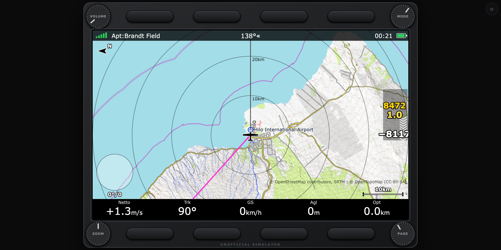

# FG9070 Soaring Computer for FlightGear



A browser-based simulation of a popular soaring computer, driven by FlightGear over
its built-in HTTP server. It runs on a second computer or tablet and is meant for learning the
unit's operation (modes, pages, soft keys, menus, task procedures, vario audio) next to the
official **LX90xx/LX80xx user manual**.

> **Unofficial.** Independent project. A training aid only – never for real navigation, and not a
> valid flight recorder. The LX90xx/LX80xx manuals are **not** part of this repository (download
> them from the manufacturer); this project implements behaviour they document, in its own code.

Built against: *LX90xx and LX80xx user manual v9.5 (Rev #61, April 2026)* and the installation
manual Rev #41. Geometry comes from there: 7.0" 800×480 screen (portrait supported), four corner
knobs (VOLUME, MODE, ZOOM, PAGE), eight dynamic push buttons.

## Run it

1. Start FlightGear with its HTTP server: `fgfs --aircraft=ask21 --httpd=5400`
   (open TCP 5400 in the firewall if the panel is on another machine).
2. Open `index.html` in a browser on the panel machine (works from `file://`; or serve the
   repo with `python3 -m http.server`).
3. Point it at FlightGear: **Setup → Hardware → Network (FlightGear)**, or
   `index.html?host=192.168.1.20&port=5400`.

No FlightGear? Add `?demo=1`: a scripted cross-country flight (thermals, speed-to-fly glides, a
triangle task you fly start-to-finish) exercises every page. `&speed=6` fast-forwards it.
`node tools/mock-fgfs-server.js` emulates FlightGear's HTTP server (including AI traffic).

Browsers only allow audio after a click or key press – the first interaction enables the vario
sound. Press `?` in the app for the key map.

## Getting real airspace (optional)

Out of the box you get a small demo airspace. Real airspace comes from [OpenAIP](https://www.openaip.net/)
(free account). There are two ways; the first needs nothing but a browser.

**Easy: download a file once and load it.**
1. Download the airspace file for your country from openaip.net (or an OpenAir `.txt` from
   soaringweb.org / asselect.uk).
2. In the trainer open **Setup → Files and Transfer → Airspace → LOAD** and pick the file
   (or drag the file onto the page). It is remembered in your browser.

**Automatic: download the airspace around your glider.** Needs an OpenAIP API key and
[Node.js](https://nodejs.org/), because OpenAIP does not let web pages talk to it directly, so a tiny helper
program has to sit in between:
1. Get a free API key: openaip.net → your account → API clients.
2. In a terminal, in this folder, run `node tools/openaip-proxy.js` and leave that window open.
3. In the trainer: **Setup → Files and Transfer → Airspace**: **Proxy** → `http://localhost:5401`,
   **Key** → paste your key, then **DOWNLOAD**.
4. OpenAIP limits how fast you may download. If it says *"stopped early … rate limit"*, wait a minute and
   press DOWNLOAD again; it continues where it stopped. Once it has finished you can close the helper: the
   airspace stays in your browser until you clear it or download again.

## Controls

| Real unit | Here |
|---|---|
| MODE knob (upper right): Airport, Waypoint, Task, Statistics, Setup, Information, Near | `← →`, drag the knob, swipe left/right |
| PAGE knob (lower right): pages / menu entries / edit values | `↑ ↓`, drag, swipe up/down |
| ZOOM knob (lower left): map zoom, fast scroll, big steps | `+ −`, mouse wheel on the screen |
| VOLUME knob (upper left): volume of what is playing now (climb / cruise) | `[ ]` |
| 8 push buttons with **dynamic functions**: first press shows the labels, second press executes (labels vanish after 10 s; menus show theirs permanently) | `1–4` top row, `5–8` bottom row, `Enter` = lower right (SELECT/EDIT), `Esc` = lower left (CLOSE); tap the on-screen labels |
| Long press upper-left button: switch off | hold button 1 |

Also `N` night, `O` landscape/portrait (or the ⟳ button; default is automatic from the window shape), `M` mute. Landscape (800×480) and portrait (480×800).

## What is implemented

**Flight computer** – TE vario from FlightGear's raw vertical speed with a selectable speed
source (**IAS default, or TAS**) and TE compensation %; netto; average/integrator; the manual's
default filters; polar (3-point quadratic), ballast, bugs; **MacCready speed-to-fly** (netto and
wind aware); final glide (arrival altitude, required and current glide ratio, Mc / Mc 0 markers);
Auto-SC (GPS circling detection, cruise/climb mode); thermal detection, thermal assistant, last-4
thermals average, thermal markers on the map; wind from FlightGear's environment.

**Audio** (Web Audio API) – the manual's modes: *Linear positive / negative, Linear, Digital
positive / negative, Linear positive only, Digital positive only* and SC modes (*SC positive,
negative, SC, SC mixed, Relative, Netto, Vario*); frequency at 0 / +100 / −100 % (500 / 1500 /
200 Hz default), volume knob, mute, DEMO. Warning tones for airspace/FLARM and confirmation alarms (task start, turn point, finish, final glide). Optional speech (Web
Speech API): final glide reached, thermal averages.

**Navigation modes** – Airport / Waypoint / Task, each with the manual's pages: map (final glide
symbol, wind arrow + thermal assistant, zoom scale, thermal-mode auto zoom), second data page,
side view, FLARM radar page, airport info, and for tasks the time-limited (AAT) page and the times
page; plus extras: a **vario page**, an **instrument page** (artificial horizon, airspeed /
altitude / vario tapes, compass tape) and a **3D synthetic terrain view** (ray-marched from the DEM). Soft-key sets (MORE>>): AIRSPACE, FLARM, MARK, MAP, WIND,
MC/BAL, SELECT, PAN, LAYOUT, EVENT, NIGHT, OFF; Task: EDIT, ARM/START/NEXT, RESTART, MOVE; Waypoint:
EDIT, NEW, DELETE. **LAYOUT** edits the navboxes of a page (58 boxes from the manual's list).

**Page layout** – the LAYOUT button works like the manual's chapter 8: EDIT, DELETE, ADD / COPY above or below,
SETTINGS; in edit mode MODE selects a symbol, PAGE moves it left/right, ZOOM up/down, RESIZE/MOVE, NEW (map, navbox,
final glide, wind/thermal assistant, scale, north arrow, vario dial/tape, side view, FLARM radar, meteogram, text),
EDIT, CLOSE (asks to save). Built-in map pages become editable on EDIT; the other built-in pages stay fixed.
**Task map edit** (task editor → VIEW three times): move the cross with MODE/PAGE (or tap/drag), GRAB/DROP,
INSERT into a leg, DELETE, ZONE, SNAP. **FAI triangle assistant** with ROT.FAI and km lines, optimised path on the
map. **Start gate**: "Start opens at" plus the gate interval (one valid minute per gate) with a *Gate* navbox.
**Flight declaration** (.hdr with IGC C-records, save/load), **PDF reader** (pdf.js, bookmarks), **checklists**
(text files; last page of APT/WPT/TSK), **meteogram** (Open-Meteo forecast for the selected airport; page in APT/WPT
and a layout symbol).

**Tasks** – observation zones (cylinder, sector, line, assigned areas with MOVE), start procedures
(START, ARM, "Inside start zone"/"Task started" prompts, max start altitude/ground speed → A/G/AG,
below-altitude B, event/PEV procedure with wait and window, gate interval stored), turn points with
Auto next / NEXT, finish, task speed and required speed, task edit dialog (EDIT, OK, CANCEL, ZONE,
OPTIONS, VIEW, LOAD, SAVE, INVERT, INS PNT, DEL PNT, CLEAR, MOVE UP/DN), airport select (filter,
ICAO and list methods).

**Warnings** (manual 7.1.10) – airspace (orange when the projected position crosses a zone, red when
also in the buffer or inside; horizontal/vertical buffers; QUIT / DISMISS minutes; alarmed zones drawn
thick with distance), altitude warning, time alarms, waypoint warning, FLARM alarms (low / medium /
high from the time to closest approach).

**Data** – on the first GPS fix the trainer downloads free data around you automatically (Setup →
Graphics / `autoData`): **OurAirports** airports with runways and frequencies (airport info page also shows
sunrise/sunset and a live **METAR**), kept in the browser. Also load SeeYou **CUP** (waypoints + tasks),
**OpenAir** and OpenAIP-JSON airspace, OurAirports CSV (file picker, drag & drop, or **Load from URL**);
OpenAIP online download needs a free key and the small helper described under *Getting real airspace*. Base map: **OpenTopoMap** raster tiles by default (OSM optional);
**terrain** from free Terrarium elevation tiles drives the hillshaded map, side view, height above ground and the
terrain-aware final glide ("climb N m" + red collision marker). Override all servers with
`?sources=http://host:port` (self-hosted/offline mirror). Free sources only.

**Recorder and statistics** – flight recording while flying, logbook with **replay** (map coloured
by altitude / speed / climb, barogram, statistics, optimisation), **IGC export** (marked
*unofficial*), in-flight statistics (thermal graph), detailed task statistics, **OLC-style free
distance** (3 TP) and a simplified FAI triangle.

**Setup** (manual order) – QNH and RES, Flight Recorder, Weight and Balance, Vario Parameters,
Display (brightness, orientation, night), Files and Transfer, Graphics (**Map and Terrain**: 14 terrain colour schemes, shadows, quality, offset, background, wind lines; **Glider and Track**: flown-path
colouring by Mc / vario / altitude / ground speed, path length, track / target / collision options, range circles, glider
range area; **Weather** (free services, off by default: Meteosat satellite from EUMETSAT, a coarse Open-Meteo forecast grid of
cloud cover / CAPE / boundary-layer height / precipitation, RainViewer rain radar with animated history); **Airspace** per-type zoom/colour/width/opacity and ceiling filter; **Waypoints and Airports** labels, max visible,
colourised reachability and short-runway crosses; **Thermal Mode**; the Optimization, Task, FLARM and Misc. looks), Sounds (Audio, Volumes,
Voice, Alarms), Observation Zones (defaults + the manual's templates), Optimization, Warnings, Units,
Hardware (Vario Unit/TE, Network, FLARM traffic source), Polar and Glider, Profiles and Pilots
(save/switch/rename/export), About.

**FLARM traffic** (colour by relative height, blinking when lost, PCAS circles for powered traffic, MacCready glide rings on the radar, flown paths, voice warnings with the manual's warning contents) – simulated demo traffic, or FlightGear AI/multiplayer aircraft (gliders only by default, recognised by model name; extra words and an "all aircraft" option in Setup → Hardware → FLARM) via
`/json/ai/models` (**experimental**, tested against the mock server only).

## Limitations vs the real computer (read before training on it)

- **Map data is only as good as what you load.** Offline you get a *procedural terrain* and a
  *demo task/airfields/airspace*; with internet the OurAirports/tile/terrain downloads replace them
  (airspace needs a file or OpenAIP key). Do not use any of it for anything real. The live OurAirports,
  tile, Terrarium, METAR and OpenAIP servers could not be reached from the development sandbox – the code
  is tested against local fake servers only, so report anything that misbehaves online.
- **Reconstructed, not copied:** soft-key sets and page layouts follow the manual where it is
  explicit; the exact button positions, fonts, icons, beep timing of the vario audio, the digital
  steps and the SC value scale are my best approximations. Glider **polars are approximate**
  (ASK 21, MDM-1, two generic): enter yours in `js/flight/polar.js`.
- Airspace limits are treated as MSL (AGL limits are not resolved against terrain). Relative/"super netto" uses netto.
- The optimiser is a simplified OLC/FAI tool (distance only, no scoring rules, triangle vertices on
  track points). IGC files from here are not valid for any badge/record/contest.
- IAS is FlightGear's `/velocities/airspeed-kt`; wind comes from the sim's environment, not from a
  wind estimator.

## Not implemented

HAWK / inertial wind, AHRS, angle of attack, flaps, engine, battery monitor (LXDAQ), vario
indicators/repeater, remote stick, 232 bridge (radio, transponder), team code, NOTAM, FLARM
hardware settings, the Windows **LX Styler** program and its file formats (the on-device LAYOUT editor *is*
implemented), SoaringSpot, SD/USB/Connect/Wi-Fi, passwords/admin, languages other than English
(by decision), gear warning. Also missing: NMEA Output,
TO NANO (task declaration to a Nano recorder), the satellite sky view and FREQ on the info pages,
centre-of-gravity limits in Weight and Balance, Save to SD, OLC points scoring, and per-symbol fonts in
the layout editor. Found by a read-through of the manual's Setup chapters (7.1.1-7.1.12): in **QNH and RES** an independent
Safety Mc, magnetic variation, the four ETA/ETE calculation methods and Soaring start; in **Graphics** (7.1.7) land-feature elements, label zoom, raster maps, airspace
zones of inactive/NOTAM types and separate side-view styles and per-type waypoint label details are missing (Glider and Track, Thermal Mode, Optimization, Task, FLARM and
Misc. exist, without Hawk Netto / engine colouring, the glide-ratio averaging time, flown task and AAT isolines, PCAS timeout,
button proximity and font size); in **Hardware** the I8/I9 indicator setups,
Bridge 232, rear/front seat, angle of attack, engine, flaps and analog inputs. Airspace has no keyless download source I could verify – load a file
(Setup → Files and Transfer → Airspace lists the free websites).
In **Polar and Glider** (7.1.13) only the four built-in gliders can be chosen: there is no editing of the a/b/c polar coefficients or reference weight, no list of several stored gliders, no glider speeds / flap labels (stall warning), no dump-rate table and no .lxg load/save.

## Layout

```
./
  index.html, css/lx.css, package.json, LICENSE
  js/shared/   helpers + FlightGear HTTP/WebSocket sources (from AeroPanel)
  tools/       mock-fgfs-server.js (fake FlightGear for testing)
  js/core/     lx.js (namespace, settings, units)
  js/data/     props.js (FlightGear properties), demo-xc.js, ai-traffic.js
  js/flight/   te.js, polar.js (MacCready, final glide), state.js (the "brain"), geo.js
  js/nav/      nav.js, task.js (zones, start procedures), warnings.js, files.js (parsers, store,
               data bootstrap), dem.js (terrain), sun.js, optimizer.js, recorder.js
  js/audio/    vario-audio.js
  js/ui/       device.js, screen.js (modes, soft keys), map.js, symbols.js, forms.js
  js/pages/    nav-pages.js, layout-editor.js, task-map.js, docs-ui.js, navboxes.js, task-edit.js, files-ui.js, warnings-ui.js, stats.js
               (+replay), info.js (+Near), setup.js, setup2.js
  tests/       node tests (see below)
```

Tests (plain `node`, no dependencies): `audio`, `flight` (TE, polar, MacCready, final glide), `demo`,
`task` (zones, start/finish, ARM, PEV, AAT), `files` (CUP, OpenAir, OurAirports, OpenAIP, IGC),
`warnings`, `optimizer` (+recorder), `ai`, `dem`, `sun`, `map` (path colouring), `weather`, `openaip-proxy`.
Online pieces without a key: Open-Meteo (meteogram, forecast layer), RainViewer and EUMETSAT EUMETView (weather layers; `tools/weather-probe.js` tests that they are reachable), pdf.js from jsDelivr (PDF reader), OurAirports, OpenTopoMap, Terrarium. Run `npm test` (or `for t in tests/*.test.js; do node $t; done`) from this folder.
The FlightGear HTTP/WebSocket sources and small helpers in `js/shared/` come from the author's AeroPanel instrument-panel project (MIT) and were copied in so this folder is fully standalone.

## FlightGear properties used

`/position/{latitude-deg,longitude-deg,altitude-ft,ground-elev-m}`, `/velocities/{airspeed-kt,
groundspeed-kt,vertical-speed-fps}`, `/instrumentation/airspeed-indicator/true-speed-kt` (optional,
else derived), `/orientation/{heading,pitch,roll}-deg`, `/environment/{wind-from-heading-deg,
wind-speed-kt,pressure-sea-level-inhg}`, and `/ai/models` for traffic. Optional properties that an
aircraft lacks are retried rarely rather than every cycle.
